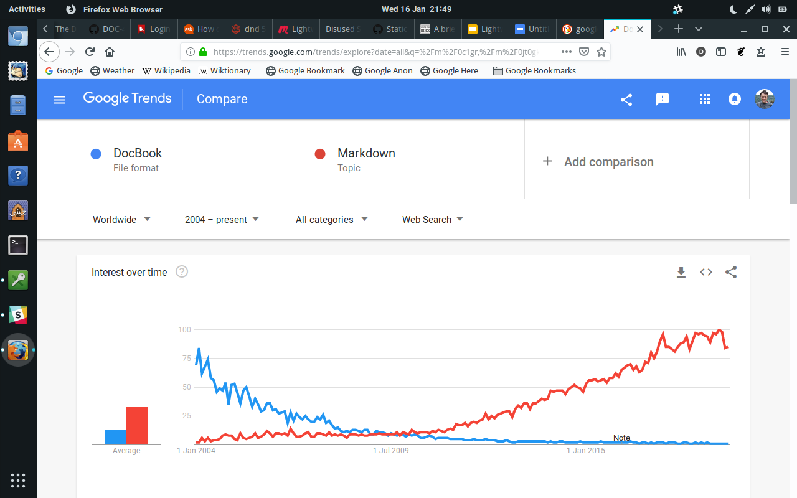
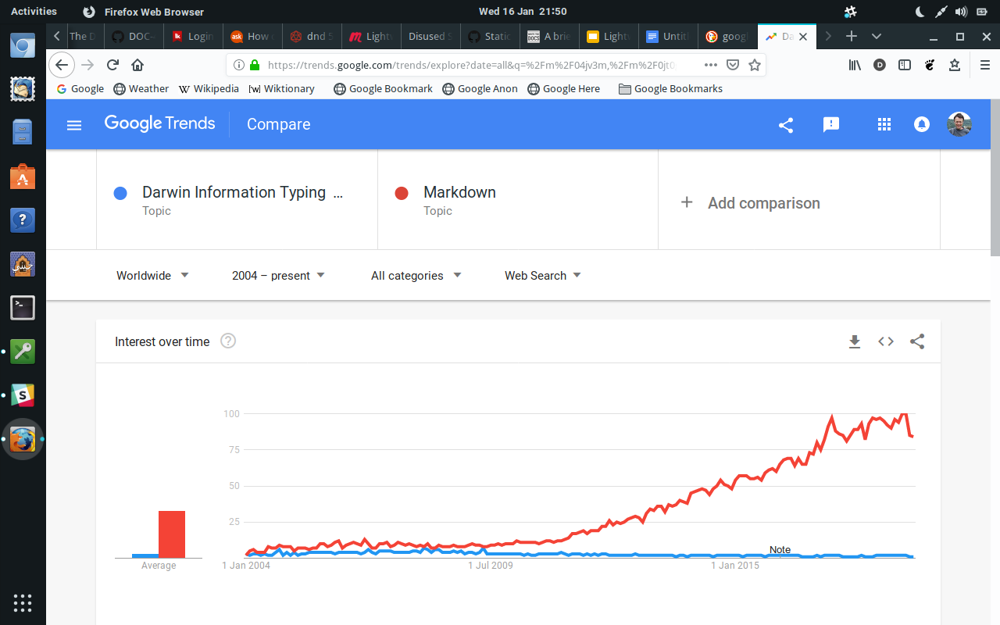
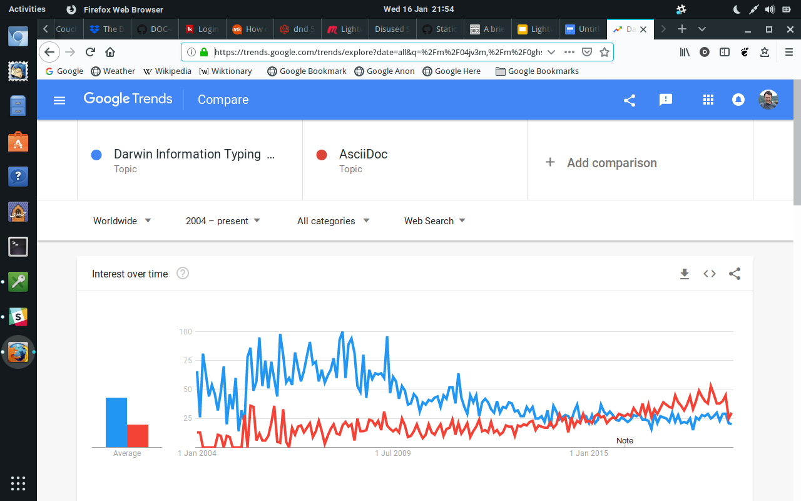
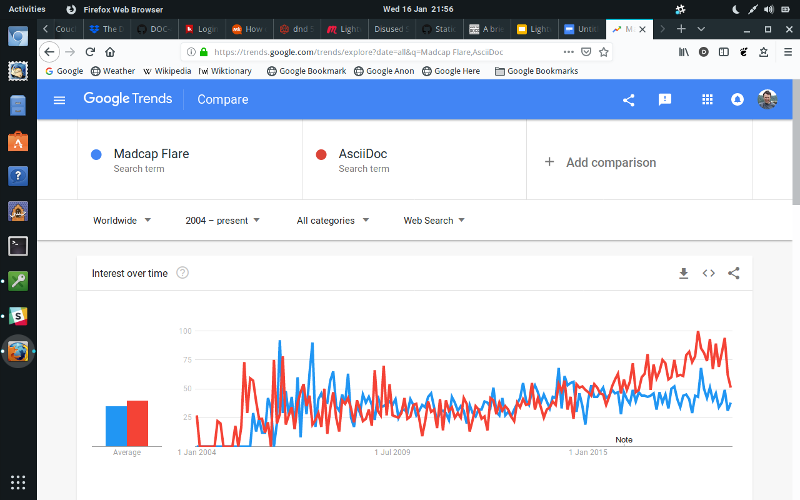

# Lightweight Markup Languages

An introductory talk by [Simon Dew](https://github.com/janiveer)

Presented at for [Write the Docs North England](https://www.meetup.com/Write-the-Docs-North/),
January 2019

---

I’m a technical author, so this talk looks at lightweight markup languages from a personal, tech comms perspective.
I’m not going to pretend it’s universal or definitive.

Historically, many tech authors have used specialist authoring tools to produce their documentation:

* Microsoft Word (1983)
* [Adobe RoboHelp](http://www.adobe.com/products/robohelp.html) (1992)
* [Madcap Flare](https://www.madcapsoftware.com/products/flare/) (2005)

However opposed to this, there has always been another group of tech authors using markup languages.

A markup language is a language that encodes the semantics and / or presentation of text along with the text itself.

I’m not going into the history of markup languages in great detail. For more information, see [A Brief History of Text Markup Languages](https://www.writethedocs.org/videos/prague/2018/a-brief-history-of-text-markup-languages-tony-ibbs/), Tony Ibbs, Write the Docs Prague 2018.

But, looking at the landscape around the year 2000, the main markup languages in the field of technical communications were probably:

* [LaTeX](http://latex-project.org/) (1983)
* [DocBook](http://docbook.org/) (1991)
* [HTML](https://www.w3.org/html/) (1993)
* [DITA](https://docs.oasis-open.org/dita/dita/v1.3/dita-v1.3-part3-all-inclusive.html) (2001)

These lists are far from complete.

> Demo:
>
> * [LaTeX](LaTeX/sample2e.tex)
> * [DocBook](DocBook/Linguistic-Processing.docbook)
> * [DITA](DITA/c_about_defining_payload.dita)

These “full” or heavyweight markup languages didn’t have human readability as their first priority.
They mostly attempted to cover most possible use cases.
They are, to a greater or lesser extent, verbose (tag heavy) and strict.

## Lightweight Markup Languages

Came about as a response to this. Surprisingly early!

* [AsciiDoc](http://asciidoc.org) (2002)
* [reStructuredText](http://docutils.sourceforge.net/rst.html) (2002)
* [Markdown](https://daringfireball.net/projects/markdown/) (2004)

And so on. There are many more.

> Demo:
> 
> * [Markdown](Markdown/Vigenere.md)
> * [AsciiDoc](../home/modules/ROOT/pages/index.adoc)

The philosophy behind these lightweight markup languages is: they’ve got to be human readable (humane). So keep the markup as minimal as possible. As a compromise, don’t attempt to cover every conceivable use case. (We’ll come back to this.)

Lightweight markup is based on conventions that had grown up in plain text email, in Usenet, in IRC, going back to bulletin boards. Asterisks for strong emphasis. Underlines for emphasis. Square brackets for links. Asterisks for bulleted lists. Indentation for quotes. And so on.

## Growth

So they’ve been around for a while. But recently, lightweight markup languages have seen a growth in popularity. Are they outstripping heavy markup languages?

(Totally unscientific; just indicative of trends.)

* [DocBook versus Markdown](https://trends.google.com/trends/explore?date=all&q=%2Fm%2F0c1gr,%2Fm%2F0jt0gkj)

  

* [DITA versus Markdown](https://trends.google.com/trends/explore?date=all&q=%2Fm%2F04jv3m,%2Fm%2F0jt0gkj)

  

* [DITA versus AsciiDoc](https://trends.google.com/trends/explore?date=all&q=%2Fm%2F04jv3m,%2Fm%2F0ghs0s)

  

Are they taking some users from dedicated software tools? Maybe...

* [MadCap Flare versus AsciiDoc](https://trends.google.com/trends/explore?date=all&q=Madcap%20Flare,AsciiDoc)

  

## Why?

I would suggest two interlinked reasons:

1. People other than technical authors are contributing to the docs.
2. The Docs Like Code methodology.

### Other People Contributing to the Documentation

People other than technical authors — could be internally, e.g. engineers or subject matter experts.

See also the rise of Scrum or Agile: in a strict Scrum team there are only scrum developers, which means any of them may pick up documentation tasks!

Could be externally — open source contributions.

(Is there more to document? See the rise of web API documents.)

None of these groups want to buy or learn specialist software. Furthermore DocBook, DITA and LaTeX are complicated.

### Docs Like Code

[Docs Like Code](https://www.docslikecode.com/), Anne Gentle, 2017. 

Using the same processes and tools for documentation as you do for software, whether that’s writing, reviewing, or version control.

It is possible to use Docs Like Code with traditional markup languages, but it’s difficult: e.g. diffing an XML file.
It’s also possible to use Docs Like Code with RoboHelp or Flare, but it’s difficult for the same reasons.
(They use XHTML file format.)
It's almost impossible to use Docs Like Code with a binary file format, e.g. Word.

> Demo:
>
> Diff [DocBook/Fixup_Test.docbook](DocBook/Fixup_Test.docbook) and [DocBook/Fixup_Result.docbook](DocBook/Fixup_Result.docbook).

It’s much easier with lightweight markup languages.

## Writing and Publication

The big difference between markup languages and specialist authoring applications is the specialist authoring application takes care of both writing and publication.
So you use Flare to write your Flare help topics, then use the same application to generate your online help or your PDF.

With a markup language, traditional or lightweight, you have to use one tool (an editor) to write the markup and another tool (usually command line) to turn the markup into the target format.

## Editors

It is perfectly possible to use a text editor or IDE to write markup. Vim, EMACS, Sublime Text, Atom, Visual Studio Code; whatever is your favourite.

But because of the tag heaviness, many people used a graphical editor, such as [Oxygen](https://www.oxygenxml.com/), to edit traditional markup.
This is less necessary with lightweight markup; I would guess most people just use a text editor or IDE.

> Demo: 
> 
> 1. Create a branch.
> 2. Edit [../home/modules/ROOT/pages/index.adoc](../home/modules/ROOT/pages/index.adoc).
>
> Notice it’s easier to read and edit. (More “humane”).
>
> You can see it's not WYSIWYG (what you see is what you get).
> However there are plugins for browsers and text editors to preview lightweight markup languages.
> Or you can use a service which watches your source files for changes, and rebuilds the output automatically.
> You end up having two windows or tabs open to edit the document!
> Like the Reveal Codes window in WordPerfect, which I'm old enough to remember...

### Validation (Aside)

With traditional markup you definitely need some kind of validation tool: either built into your IDE, or as a separate tool.
Otherwise, builds would often fail because you got the markup wrong.

With lightweight markup languages, validation is less necessary: they’re very lax.
You can get the markup wrong, but your publication tool will generally churn out something, even if it’s not what you intended.

## Publication Tools

For DocBook there are the [DocBook XSL stylesheets](https://github.com/docbook);
for DITA, the [DITA Open Toolkit](http://www.dita-ot.org/).

Lightweight markup languages are no different. There are many, many tools available for publication, which can be bewildering. These range from simple tools to convert a file into a different format, e.g. PDF, to *static site generators* that create an entire web help site.

* reStructuredText:
  [Sphynx](http://www.sphinx-doc.org/en/master/index.html)
* Markdown: [Kramdown](https://kramdown.gettalong.org/),
  [PanDoc](https://pandoc.org),
  [Jekyll](https://jekyllrb.com/)
* AsciiDoc:
  [AsciiDoctor](https://asciidoctor.org),
  [Antora](https://antora.org)

The Docs Like Code website has a good introduction to some of these. Also ask your local [Write the Docs](https://www.writethedocs.org/) group!

> Demo:
>
> 1. Use Antora to build this site: `antora local-antora-playbook.yml`
> 2. Show the [output](https://janiveer.github.io/lightweight-markup/).

## Review

One advantage of lightweight markup languages is that they’re supported within platforms like GitHub, blogging platforms, wiki platforms.

> Demo:
>
> 1. Push the changes to GitHub.
> 2. Create a [pull request](https://github.com/janiveer/lightweight-markup/pull/3).
> 3. Show GitHub's [review features](https://github.com/janiveer/lightweight-markup/pull/3/files).
> 4. Ask an attendee to provide feedback and approve the changes.
> 5. Merge the changes.

Mention *continuous integration*: use a tool like Jenkins to rebuild your website automatically every time you merge a change to the master branch.

## Problems and Caveats

You need to choose the lightweight markup language that meets your needs.
Markdown is enough for simple applications, but falls short for complex applications.
For a more complex application, something like AsciiDoc is a good compromise.

Are lightweight markup languages always easier to write?
I would say not, for more advanced features anyway.
For example, creating a footnote in XML: you know that the markup is going to be something like `<footnote>`.
Creating a footnote in AsciiDoc? I have to look at the cheat sheet every time.

Finally, you can’t get away from the fact that lightweight markup languages are less capable than XML based markup languages; deliberately so.
They are designed to be a useful compromise for 99% of use cases.

Questions? Thanks!

---

  
This work is licensed under a [Creative Commons Attribution-ShareAlike 4.0 International License](http://creativecommons.org/licenses/by-sa/4.0/).